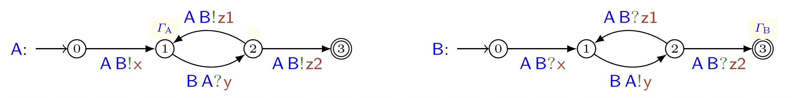

<table style="border: none; border-collapse: collapse;">
<tr>
<td valign="middle" style="border: none; padding: 0;"></td>
<td valign="middle" style="border: none; padding: 0;"><h1>MoCheQoS: A Tool for Static Analysis of QoS in Communicating Systems</h1></td>
</tr>
</table>

MoCheQoS is a bounded model checker for quality of service (QoS) properties of distributed message-passing systems. It exploits features of [ChorGram](https://bitbucket.org/eMgssi/stable_chorgram/wiki), a tool chain to support choreographic development of message-oriented applications.

## Installation

We offer two installation methods: manual installation and Docker installation. For detailed instructions, please see our [installation guide](wiki/installation.md).

## Using MoCheQoS

For detailed usage instructions and documentation, please visit our [wiki](wiki/home.md).

## Example

MoCheQoS can analyze QoS properties of distributed systems. Here's a practical example with two communicating machines:



**System Configuration:**
- Machine A: Memory constraint (5 ≤ mem ≤ 10) with cost function (cost = 0.2 × mem)
- Machine B: No memory usage (mem = 0) with fixed cost (cost = 1)

**Property to Verify:** ⟨G⟩(2 ≤ cost ≤ 3)
- ⟨ ⟩ is the 'eventually' operator from temporal logic
- G = A → B: x; B → A: y; A → B: z2

**Satisfiability Check:**
```bash
mocheqos satisfiability experiments/format-example/sys.qosfsa experiments/format-example/Phi.ql 6
```
*Result: `Satisfiable.` - MoCheQoS finds a concrete execution trace that satisfies the property.*

**Validity Check:**
```bash
mocheqos validity experiments/format-example/sys.qosfsa experiments/format-example/Phi.ql 6
```
*Result: MoCheQoS searches for counterexamples to verify if the property holds for all possible execution paths within the given bound.*