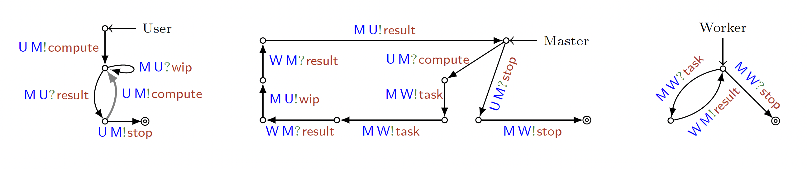

# Reproducing experiments

This document presents the experiments published in the following paper:

    Lopez Pombo, C.G., Martinez Suñé, A.E., Tuosto, E. (2025). Automated Static Analysis of Quality of Service Properties of Communicating Systems. In: Platzer, A., Rozier, K.Y., Pradella, M., Rossi, M. (eds) Formal Methods. FM 2024. Lecture Notes in Computer Science, vol 14934. Springer, Cham. https://doi.org/10.1007/978-3-031-71177-0_7

## Prerequisites

To run the experiments, you need:
- **Python 3** with the following packages (only needed for running these specific experiment scripts, not for using mocheqos itself):
  - `numpy`
  - `matplotlib`
- **MoCheQoS tools** - set up as described in [installation.md](installation.md)

The results presented in the paper have been obtained running MoCheQoS on an 8-cores MacBook Pro (Apple M1) with 16GB of memory.
All the experiments measure execution times. The execution times reported in the paper may differ from the ones reproduced within the Docker container (possibly due to different hardware).

This section specifies how to reproduce our experiments. We recall that our experiments are tailored to evaluate applicability and scalability of our approach. 

Towards applicability we show:

- **SLA in the Amazon cloud**: develops a case study adopting SLAs from the AWS cloud.
- **Model extraction**: borrows a case study from the literature to show how our approach can leverage automatic extraction of communicating systems

Towards scalability we show:

- **Loop unfolding**: How does performance evolve as we increase the number of loop unfoldings in g-choreographies indexing ‘until’ sub-formulae?
- **Nested choices**: How does average performance evolve as we increase the number of nested choices in g-choreographies indexing ‘until’ sub-formulae?

Each item is considered in the corresponding subsection (matching the subsections of Section 4 of the paper).

## SLA in the Amazon cloud

The system used in the case study of section 4.1 of the paper is modeled in the file `experiments/amazon-cloud/sys.qosfsa`. The formulas `Φ1` ... `Φ4` described in the last paragraph of the section are written in the files `experiments/amazon-cloud/price-bound-1.ql` ... `experiments/amazon-cloud/price-bound-4.ql`.

For a detailed description of the system and the formulas please see section 4.1 of the paper.

Running the following commands will evaluate the validity of each formula while computing the execution time. You can compare this results with the ones described in the last paragraph of section 4.1 of the paper.

### Validity of Φ1
```bash
time mocheqos validity experiments/amazon-cloud/sys.qosfsa experiments/amazon-cloud/price-bound-1.ql 26
```

### Validity of Φ2
```bash
time mocheqos validity experiments/amazon-cloud/sys.qosfsa experiments/amazon-cloud/price-bound-2.ql 26 --show-model
```

### Validity of Φ3
```bash
time mocheqos validity experiments/amazon-cloud/sys.qosfsa experiments/amazon-cloud/price-bound-3.ql 100
```

### Validity of Φ4
```bash
time mocheqos validity experiments/amazon-cloud/sys.qosfsa experiments/amazon-cloud/price-bound-4.ql 100
```

## Model extraction

The system used in the case study of section 4.2 of the paper is modeled in the file `experiments/model-extraction/sys.qosfsa` and is shown in the figure below.



The formulas `Φ1` ... `Φ4` described in the last paragraph of the section are written in the files `experiments/model-extraction/phi1.ql` ... `experiments/model-extraction/phi4.ql`.

For a detailed description of the system and the formulas please see section 4.2 of the paper.

The following command will run the checks needed to complete Table 3 of section 4.2 of the paper. It will print one row at a time starting with `Φ1` and ending with `Φ4`. For each row, it will execute the experiments as presented in Table 3 from left to right, starting with `satisfiability` with bound `k = 18` and ending with `validity` with bound `k = 32`. 

```bash
python3 experiments/model-extraction/run-experiments.py
```

You can compare these results with the ones described in Table 3 of section 4.1 of the paper.
Notice that when the table states `No CE` the tool should output the text `No counterexample found within the given bounds.`. Similarly, when the table states `CE` the tool should output the text `Not valid.`.

## Loop unfoldings

The system used in the experiments section 4.3 (subsection "Loop unfolding") of the paper is modeled in the file `experiments/loop-unfolding/sys.qosfsa`.
The experiments consist of checking the satisfiability of synthetically generated formulas with the shape `Φ1 Until [G] Φ2`, where `G` is the `n`-unfolding of the loop in the system and `n` ranges from 1 to 10. For a detailed description of the system and the formula please see section 4.2 of the paper.

### Satisfiable formulas

The following instructions will guide you to reproduce _Figure 2a_ of the paper. Due to execution time constraints, the following commands will only run a subset of the experiments, specifically reproducing _Figure 2a_ up to n = 8. 
Running these subset of the experiments took about 15 minutes in our machine.

If you have available execution time to run the complete experiments (up to n = 10) you should replace `sat-subset` with `sat` on each command and directory name stated in this subsection of the tutorial. These complete experiments took about 1 hour in our machine.

To run the three experiments on satisfiable formulas, run the following command:
```bash
python3 experiments/loop-unfolding/run-experiments.py sat-subset
```
Running this command took 33 minutes on our machine. The script synthetically generates satisfiable formulas and checks their satisfiability, measuring the time taken by MoCheQoS to solve each formula. Specifically, it generates three families of formulas with the shape `Φ1 Until [G] Φ2`: 

1. where both `Φ1` and `Φ2` are atomic truth values,
2. where `Φ1` is an atomic truth value and `Φ2` is a QoS constraint,
3. where both `Φ1` and `Φ2` are QoS constraints.

For each family, the script generates a formula for each value of `n` (the number of unfoldings in `G`) ranging from 1 to 10.

The results will be stored in the directory `experiments/loop-unfolding/results/sat-subset/`.

To plot these results, run the following command:
```bash
python3 experiments/loop-unfolding/plot-results.py sat-subset
```

The plot will be stored in file `experiments/loop-unfolding/results/plot-sat-subset.pdf`. Our plot is shown in _Figure 2a_ of the paper.

### Unsatisfiable formulas

The following instructions will guide you to reproduce _Figure 2b_ of the paper. Due to execution time constraints, the following commands will only run a subset of the experiments, specifically reproducing _Figure 2b_ up to n = 8. 
Running these subset of the experiments took about 20 minutes in our machine.

If you have available execution time to run the complete experiments (up to n = 10) you should replace `unsat-subset` with `unsat` on each command and directory name stated in this subsection of the tutorial. These complete experiments took about 1 hour and a half in our machine.

To run the three experiments on unsatisfiable formulas, run the following command:
```bash
python3 experiments/loop-unfolding/run-experiments.py unsat-subset
```
As in the previous experiment, the script synthetically generates unsatisfiable formulas and checks their satisfiability, measuring the time taken by MoCheQoS to solve each formula. 

The results will be stored in the directory `experiments/loop-unfolding/results/unsat-subset/`.

To plot these results, run the following command:
```bash
python3 experiments/loop-unfolding/plot-results.py unsat-subset
```

The plot will be stored in file `experiments/loop-unfolding/results/plot-unsat-subset.pdf`. Our results are shown in _Figure 2b_ of the paper.

## Nested choices

### Generate the systems and formulas

The systems and formulas for the experiments of section 4.2 (subsection "Nested choices") of the paper can be synthetically generated by the script `experiments/nested-choices/generate-data.py`. 
The systems have two participants that take turns in sending a message to each other; each turn the sender chooses between two messages, which makes the number of runs in the system grow exponentially with the number of nested choices.

Generate the systems to be analyzed by running the following command:
```bash
python3 experiments/nested-choices/generate-data.py sys
```
The script iterates over the number `n` of nested choices (1 <= `n` <= 10), generates a system in `.qosgc` (qos-extended g-choreography) format for each number, and stores it in the directory `experiments/nested-choices/sys/`.

Since the systems are in `.qosgc` but MoCheQoS requires `.qosfsa` files, we need to use ChorGram's `project` command to convert them to the qos-extended communicating system format.

Run the following command to convert the systems to `.qosfsa` format:
```bash
bash project-nested-choices.sh
```
This step might take several minutes as some of the systems are large; it took 7 minutes on our machine.
The script iterates over all `.qosgc` systems in the directory `experiments/nested-choices/sys/` and calls ChorGram's `project` command to convert them to `.qosfsa` format and store them in the same directory.

The formulas to be analyzed are of the shape `True Until [G] ψ` and are satisfied by only one run of the system.
Generate the formulas to be analyzed by running the following command:
```bash
python3 experiments/nested-choices/generate-data.py prop
```

The script iterates over the number `n` of nested choices (1 <= `n` <= 10), generates 100 formulas in `.ql` format for each number, and stores them in the directory `experiments/nested-choices/prop/`. The generation of each formula is randomized. For reproducibility, the generation script contains the same random seed used in the paper.

### Run the experiments

For each number of nested choices, the experiments presented in the paper check the satisfiability of 100 formulas. We give two options: to run a representative subset of the experiments, or to run all of them. Choose either (A) or (B) below and then continue.

#### (A) Run a subset of the experiments

The following command runs the experiments for only 10 formulas per number of nested choices:
```bash
python3 experiments/nested-choices/run-experiments.py 10
```
This command took 1 hour and 11 minutes on our machine. The script iterates over the number of nested choices, iterates over the first 10 formulas for each number, and calls MoCheQoS to check the satisfiability of each formula.

The results will be stored in the directory `experiments/nested-choices/results/`.

#### (B) Run all of the experiments

The following command runs the experiments for all the 100 formulas per number of nested choices:
```bash
python3 experiments/nested-choices/run-experiments.py
```
This command took 11 hours and 17 minutes on our machine. Notice that this large amount of time is due to the fact that the script is running 100 formulas for each number of nested choices, which amounts to 1000 calls to MoCheQoS in total. The actual performance results can be seen in the plot generated in the next step.

The results will be stored in the directory `experiments/nested-choices/results/`.

### Plot the results

To plot the results, run the following command:
```bash
python3 experiments/nested-choices/plot-results.py
```

The plot will be stored in file `experiments/nested-choices/results/nested-choices.pdf`. Our results are shown in _Figure 3b_ of the paper, which shows a boxplot of the time taken by MoCheQoS to solve each formula for each number of nested choices. Be aware that, if you ran the subset of the experiments, the plot might look different from the one in the paper as 10 formulas per number of nested choices might not be enough to show the trend.